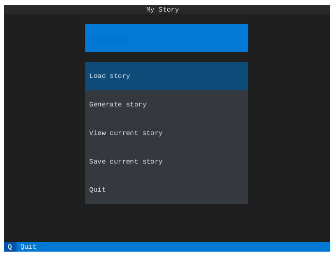

Storytime!
==========

View and create interactive stories in terminal
------------------------------------------------

With `storytime`, you can create fun interactive stories in your terminal. Just write a markdown file with your dialogues, choices and simple logic. An example file can be found in `minimal.md`_. You can also create a story with the built-in `openai` integration.

.. _`minimal.md`: storytime_ai/templates/minimal.md

.. note::

    - This project is under active development.
    - A *web version* is planned
    - *storytime_ai* is the name of the python package
    - Documentation hat `dronakurl.github.io/storytime/`_

.. _`dronakurl.github.io/storytime/`: https://dronakurl.github.io/storytime/
.. _marker: 

.. include:: ./docs/usage.rst

Usage
=====

.. _installation:

How to install 
--------------

- Install the latest release version with `pip`

   .. code-block:: console

      pip install 'git+https://github.com/Dronakurl/storytime.git@0.2.1#egg=storytime_ai[extras]'

- Set environment variable with openai api key (optional)

  To use the story generation with openai, you need to set the environment variable `OPENAI_API_KEY` to your openai api key. You can get your api key from the `openai settings <https://platform.openai.com/account/api-keys>`_. The environment variable can be set in a file `.env` in the root directory of this project.

  Example `.env` file

   .. code-block:: console

      OPENAI_API_KEY="sk-p9GOXXXXX<Your OPENAI_API_KEY>"

Start the Storytime terminal app
--------------------------------

Run Storytime with

   .. code-block:: console
      
      storytime [markdown_file with your own story]

Helper script: Check integrity of your story
--------------------------------------------

You can check if your story is valid with the following command

   .. code-block:: console

      storytime-checker [markdown_file with your own story]

It will check if all the choices are valid and if all dialogues are connected.

